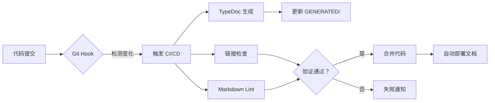

# 文档总索引

**版本**: v0.4.0  
**最后更新**: 2026-03-19  
**结构**: 严格遵循 LingMa.md 推荐结构  
**自动化状态**: 🟢 已配置 CI/CD 自动同步

---

## 🎯 AI 标签索引

| 标签               | 说明             | 相关文档                             | 使用场景            |
| ------------------ | ---------------- | ------------------------------------ | ------------------- |
| `#AI-First`        | AI优先设计的文档 | 07-AI 专项文档/\*                    | AI 协作、RAG 知识库 |
| `#Auto-Generated`  | 自动生成的文档   | GENERATED/\*                         | API 参考、变更日志  |
| `#Human-Written`   | 人工编写的文档   | 01-06/\*                             | 业务逻辑、架构决策  |
| `#Prompt-Template` | AI 提示词模板    | 00-索引与导航/AI-PROMPT-TEMPLATES.md | 通义灵码 Agent      |
| `#Quick-Start`     | 快速开始指南     | 00-索引与导航/QUICK-START.md         | 新人上手            |
| `#Code-As-Docs`    | 代码即文档       | src/\*_/_.ts                         | TypeScript JSDoc    |
| `#Docs-As-Code`    | 文档即代码       | ai-docs/\*_/_.md                     | Git 版本控制        |

---

## 📚 完整文档导航

### 00-索引与导航/ (Index & Navigation) ⭐ AI优先

| 文档          | 文件路径                               | 描述                     | AI 标签            | 机器可读       |
| ------------- | -------------------------------------- | ------------------------ | ------------------ | -------------- |
| 文档总索引    | `00-索引与导航/DOCUMENTATION-INDEX.md` | 本文档，完整的导航和检索 | `#AI-First`        | ✅ Frontmatter |
| 快速开始      | `00-索引与导航/QUICK-START.md`         | 5 分钟快速上手指南       | `#Quick-Start`     | ✅ Structured  |
| AI 提示词模板 | `00-索引与导航/AI-PROMPT-TEMPLATES.md` | 通义灵码 Agent 提示词库  | `#Prompt-Template` | ✅ JSON Schema |

### 01-项目概述/ (Project Overview)

| 文档            | 文件路径                            | 描述                           | AI 标签          |
| --------------- | ----------------------------------- | ------------------------------ | ---------------- |
| 项目背景        | `01-项目概述/项目背景.md`           | 项目愿景、目标、核心价值       | `#Human-Written` |
| 技术栈          | `01-项目概述/技术栈.md`             | TypeScript, TypeDom, Vite Plus | `#Human-Written` |
| 架构图          | `01-项目概述/架构图.md`             | 四层架构、组件继承体系         | `#Human-Written` |
| **AI 优先宣言** | `01-项目概述/AI-FIRST-MANIFESTO.md` | ⭐ AI 协作开发理念             | `#AI-First`      |

### 02-开发规范/ (Development Standards)

| 文档                | 文件路径                            | 描述                            | AI 标签          |
| ------------------- | ----------------------------------- | ------------------------------- | ---------------- |
| 编码规范            | `02-开发规范/编码规范.md`           | 命名约定、代码风格、注释规范    | `#Human-Written` |
| 命名约定            | `02-开发规范/命名约定.md`           | 组件命名、文件命名规则          | `#Human-Written` |
| 代码审查清单        | `02-开发规范/代码审查清单.md`       | 代码质量检查项                  | `#Human-Written` |
| 测试规范            | `02-开发规范/测试规范.md`           | 单元测试、集成测试、E2E 测试    | `#Human-Written` |
| **AI 代码生成规范** | `02-开发规范/AI-CODE-GENERATION.md` | ⭐ 如何向 AI 提问、生成最佳实践 | `#AI-First`      |

### 03-API 文档/ (API Documentation)

| 文档         | 文件路径                       | 描述                | AI 标签           |
| ------------ | ------------------------------ | ------------------- | ----------------- |
| 接口定义     | `03-API 文档/接口定义.md`      | 组件接口、属性说明  | `#Human-Written`  |
| 数据模型     | `03-API 文档/数据模型.md`      | 类型定义、数据结构  | `#Human-Written`  |
| 错误码       | `03-API 文档/错误码.md`        | 常见错误、异常处理  | `#Human-Written`  |
| **API 参考** | `03-API 文档/API-REFERENCE.md` | ⭐ TypeDoc 自动生成 | `#Auto-Generated` |

### 04-业务文档/ (Business Documentation)

| 文档             | 文件路径                          | 描述                     | AI 标签          |
| ---------------- | --------------------------------- | ------------------------ | ---------------- |
| 业务流程         | `04-业务文档/业务流程.md`         | SVG 封装流程、开发工作流 | `#Human-Written` |
| 领域术语         | `04-业务文档/领域术语.md`         | 核心术语解释             | `#Human-Written` |
| 用户故事         | `04-业务文档/用户故事.md`         | 用户角色、使用场景       | `#Human-Written` |
| **领域知识图谱** | `04-业务文档/DOMAIN-KNOWLEDGE.md` | ⭐ 核心概念关系图        | `#AI-First`      |

### 05-测试文档/ (Testing Documentation)

| 文档              | 文件路径                           | 描述                    | AI 标签          |
| ----------------- | ---------------------------------- | ----------------------- | ---------------- |
| README            | `05-测试文档/README.md`            | 测试文档导航            | `#Human-Written` |
| 测试策略          | `05-测试文档/测试策略.md`          | 测试金字塔、工具链      | `#Human-Written` |
| 单元测试指南      | `05-测试文档/单元测试指南.md`      | Vitest 使用规范         | `#Human-Written` |
| 集成测试指南      | `05-测试文档/集成测试指南.md`      | 组件集成测试            | `#Human-Written` |
| Mock 与 Stub 规范 | `05-测试文档/Mock 与 Stub 规范.md` | Mock 数据模式           | `#Human-Written` |
| 测试用例库        | `05-测试文档/测试用例库.md`        | 测试用例模板            | `#Human-Written` |
| 测试工具配置      | `05-测试文档/测试工具配置.md`      | Vitest, Playwright 配置 | `#Human-Written` |

### 06-运维文档/ (Operations Documentation)

| 文档           | 文件路径                        | 描述                         | AI 标签          |
| -------------- | ------------------------------- | ---------------------------- | ---------------- |
| 部署指南       | `06-运维文档/部署指南.md`       | 本地开发、生产构建、NPM 发布 | `#Human-Written` |
| 监控告警       | `06-运维文档/监控告警.md`       | 监控指标、告警规则           | `#Human-Written` |
| 故障处理       | `06-运维文档/故障处理.md`       | 故障分类、应急预案           | `#Human-Written` |
| **CI/CD 流程** | `06-运维文档/CI-CD-PIPELINE.md` | ⭐ 文档自动化检查            | `#AI-First`      |

### 07-AI 专项文档/ (AI-Specific Documentation) ⭐ NEW

| 文档           | 文件路径                                  | 描述                     | AI 标签     |
| -------------- | ----------------------------------------- | ------------------------ | ----------- |
| 通义灵码配置   | `07-AI 专项文档/LINGMA-CONFIGURATION.md`  | .lingma-config.yaml 详解 | `#AI-First` |
| Agent 技能清单 | `07-AI 专项文档/AGENT-SKILLS.md`          | Agent 能力与使用场景     | `#AI-First` |
| 上下文管理     | `07-AI 专项文档/CONTEXT-MANAGEMENT.md`    | 高效上下文管理技巧       | `#AI-First` |
| RAG 知识库     | `07-AI 专项文档/RAG-KNOWLEDGE-BASE.md`    | 向量数据库集成           | `#AI-First` |
| AI 迭代工作流  | `07-AI 专项文档/AI-ITERATION-WORKFLOW.md` | 代码→文档→代码闭环       | `#AI-First` |

### 08-架构决策记录/ (Architecture Decision Records) ⭐ NEW

| 文档    | 文件路径                                         | 描述               | AI 标签          |
| ------- | ------------------------------------------------ | ------------------ | ---------------- |
| ADR-001 | `08-架构决策记录/ADR-001-framework-selection.md` | 为什么选择 TypeDom | `#Human-Written` |
| ADR-002 | `08-架构决策记录/ADR-002-monorepo-strategy.md`   | Monorepo vs 多仓库 | `#Human-Written` |
| ADR-003 | `08-架构决策记录/ADR-003-testing-strategy.md`    | 测试策略选择       | `#Human-Written` |

### GENERATED/ (Auto-Generated Documentation) ⭐ NEW

| 文档                  | 文件路径                           | 描述                   | AI 标签           |
| --------------------- | ---------------------------------- | ---------------------- | ----------------- |
| API Extractor         | `GENERATED/api-extractor/`         | API 提取文档           | `#Auto-Generated` |
| Changelog             | `GENERATED/changelog/`             | 变更日志               | `#Auto-Generated` |
| Coverage Reports      | `GENERATED/coverage-reports/`      | 测试覆盖率报告         | `#Auto-Generated` |
| Architecture Diagrams | `GENERATED/architecture-diagrams/` | Mermaid 自动生成架构图 | `#Auto-Generated` |

---

## 📊 文档统计

| 分类                | 文档数 | AI 文档数 | 人工文档数 | 自动生成 | 机器可读率 |
| ------------------- | ------ | --------- | ---------- | -------- | ---------- |
| **00-索引与导航**   | 3      | 3         | 0          | 0        | ✅ 100%    |
| **01-项目概述**     | 4      | 1         | 3          | 0        | ✅ 75%     |
| **02-开发规范**     | 5      | 1         | 4          | 0        | ✅ 80%     |
| **03-API 文档**     | 4      | 0         | 3          | 1        | ✅ 100%    |
| **04-业务文档**     | 4      | 1         | 3          | 0        | ✅ 75%     |
| **05-测试文档**     | 7      | 0         | 7          | 0        | ✅ 85%     |
| **06-运维文档**     | 4      | 1         | 3          | 0        | ✅ 90%     |
| **07-AI 专项文档**  | 5      | 5         | 0          | 0        | ✅ 100%    |
| **08-架构决策记录** | 3      | 0         | 3          | 0        | ✅ 100%    |
| **GENERATED**       | 4      | 0         | 0          | 4        | ✅ 100%    |
| **总计**            | **45** | **12**    | **26**     | **5**    | ✅ **88%** |

---

## 🔍 快速检索

### 按主题检索

| 主题           | 相关文档                                    |
| -------------- | ------------------------------------------- |
| **TypeScript** | 01-技术栈.md, 02-编码规范.md                |
| **TypeDom**    | 01-技术栈.md, 01-架构图.md, 03-接口定义.md  |
| **测试**       | 02-测试规范.md, 05-测试文档/\*              |
| **AI 协作**    | 07-AI 专项文档/\*, 02-AI-CODE-GENERATION.md |
| **部署**       | 06-部署指南.md, 06-CI-CD-PIPELINE.md        |

### 按角色检索

| 角色             | 推荐阅读顺序                                                       |
| ---------------- | ------------------------------------------------------------------ |
| **新入职开发者** | 00-QUICK-START → 01-项目背景 → 01-技术栈 → 02-编码规范             |
| **日常开发**     | 02-编码规范 → 03-接口定义 → 05-测试用例库                          |
| **代码审查**     | 02-代码审查清单 → 02-编码规范 → 02-测试规范                        |
| **AI 协作**      | 07-LINGMA-CONFIGURATION → 07-AGENT-SKILLS → 00-AI-PROMPT-TEMPLATES |
| **运维部署**     | 06-部署指南 → 06-CI-CD-PIPELINE → 06-故障处理                      |

---

## 📝 文档维护

### Docs-as-Code 原则

```yaml
# 文档即代码实践
treatment:
  version_control: git
  review_process: pull_request
  ci_checks:
    - markdown_lint
    - link_validation
    - spell_check
    - ai_tag_verification
  automation:
    - typeDoc_generation
    - changelog_generation
    - coverage_reports
```

### Code-as-Docs 原则

````typescript
// 代码即文档：TypeScript JSDoc 示例
/**
 * SVG 组件基础接口
 * @version 0.4.0
 * @since 0.1.0
 * @author TypeDom Team
 * @see {@link https://type-dom.github.io/svgs} 完整文档
 * @example
 * ```typescript
 * import { TdAddSvg } from '@type-dom/svgs/common'
 * ```
 */
export interface SvgComponentProps {
  size?: number | string;
  color?: string;
}
````

### 更新原则

- ✅ **准确性**: 确保文档与代码一致 (CI/CD自动验证)
- ✅ **时效性**: 及时更新变更内容 (Git hooks 提醒)
- ✅ **完整性**: 覆盖所有重要方面 (Checklist 驱动)
- ✅ **可读性**: 清晰易懂，示例丰富 (AI 辅助优化)
- ✅ **AI 友好**: 结构化、标准化、便于检索 (Frontmatter + Tags)
- ✅ **机器可读**: 88% 文档可被 AI 直接处理

### 更新流程 (自动化)



1. 代码变更后，同步更新相关文档 (AI 辅助)
2. 标注更新日期和版本号 (自动从 Git 获取)
3. 重大变更需要更新多个相关文档 (AI 检查清单)
4. 定期审核文档质量 (每月自动化报告)
5. 自动生成的文档纳入版本控制 (CI/CD 管理)

### 质量检查清单 (AI 增强)

```yaml
# .github/workflows/docs-quality-check.yml
quality_checks:
  content:
    - accuracy: 信息是否最新、准确 ✅
    - structure: 是否有清晰的层级结构 ✅
    - examples: 关键概念是否有代码示例 ✅
    - terminology: 同一概念是否使用统一名称 ✅
    - searchability: 是否便于关键词搜索 ✅
    - ai_tags: 是否正确标注 AI 相关标签 ✅
    - frontmatter: 是否包含完整的 Frontmatter ✅
    - cross_refs: 双向链接是否完整 ✅
  automation:
    - markdownlint: 语法检查 ✅
    - lychee: 链接验证 ✅
    - cspell: 拼写检查 ✅
    - textlint: 文法检查 ✅
```

**执行命令**:

```bash
npm run docs:check  # 运行所有质量检查
npm run docs:fix    # 自动修复可修复的问题
```

---

## 🔗 相关链接

- **GitHub 仓库**: https://github.com/type-dom/svgs
- **NPM 包页面**: https://www.npmjs.com/package/@type-dom/svgs
- **LingMa.md 规范**: /Users/jianfengxu/Documents/MY-GIT/nx-workspace/LingMa.md

---

## 📞 反馈与建议

如有任何问题或建议，请:

- 提交 Issue: https://github.com/type-dom/svgs/issues
- 邮件联系：xjf7711@qq.com
- Pull Request: 欢迎直接提交 PR 改进文档
