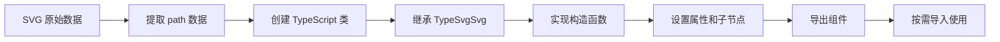
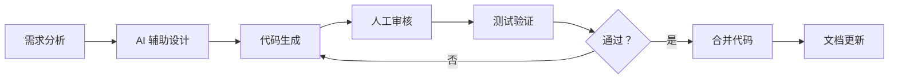

# 领域知识图谱

**@type-dom/svgs 核心概念关系与业务规则**

**版本**: v0.4.0  
**最后更新**: 2026-03-19

---

## 📖 引言

本文档构建@type-dom/svgs 项目的领域知识图谱，帮助:

- ✅ **新成员**: 快速理解核心概念及其关系
- ✅ **AI Agent**: 准确理解项目领域知识
- ✅ **开发者**: 掌握业务规则和最佳实践

---

## 🎯 核心概念体系

### 概念层次结构

```
第一层：基础概念
├── SVG (可缩放矢量图形)
├── TypeScript (类型化 JavaScript)
└── TypeDom (前端框架)

第二层：项目特定概念
├── SVG 组件 (封装的图标组件)
├── 分类系统 (Common/ElementPlus/FluentUI)
└── 索引机制 (按需导入)

第三层：技术实现概念
├── TypeSvgSvg (基类)
├── SvgPath (路径组件)
├── SvgProps (属性接口)
└── 继承体系 (类层次结构)
```

---

## 🔑 核心概念详解

### 1. SVG (Scalable Vector Graphics)

**定义**: 基于 XML 的矢量图形描述语言

**关键特性**:

- ✅ 无限缩放不失真
- ✅ 可通过 CSS/JS 控制样式和行为
- ✅ 支持路径 (path)、形状 (shape)、文本 (text) 等元素
- ✅ viewBox 坐标系统

**在项目中的角色**:

```
SVG 图形数据 → TypeDom 封装 → TypeScript 组件 → 应用程序
```

**相关概念**:

- [[viewBox]] - SVG 视口定义
- [[path]] - SVG 路径元素
- [[currentColor]] - SVG 颜色关键字

---

### 2. TypeDom Framework

**定义**: 基于 TypeScript 的前端框架，提供类型安全的组件开发体验

**核心 API**:

```typescript
import {
  TypeRoot, // 根组件
  TypeSvgSvg, // SVG 基类
  TypeElement, // 元素基类
  SvgPath, // 路径组件
  SvgProps, // SVG 属性接口
} from "@type-dom/framework";
```

**继承体系**:

```
TypeElement (抽象基类)
    ↓
TypeSvg (SVG 抽象基类)
    ↓
TypeSvgSvg (<svg> 元素基类)
    ↓
具体 SVG 组件类 (如 TdAddSvg)
```

**相关概念**:

- [[虚拟 DOM]] - TypeDom 的核心机制
- [[响应式]] - 数据变化自动更新视图
- [[类型安全]] - TypeScript 提供的类型保障

---

### 3. SVG 组件 (SVG Component)

**定义**: 使用 TypeDom 封装的可复用 SVG 图标组件

**标准结构**:

```typescript
export class TdAddSvg extends TypeSvgSvg {
  className: "TdAddSvg"; // 组件标识
  override childNodes: SvgPath[]; // 子节点类型

  constructor(params: SvgProps = {}) {
    super(params);

    // 1. 设置类名
    this.className = "TdAddSvg";

    // 2. 设置属性
    addAttrObj(this, {
      viewBox: "0 0 1024 1024",
      name: "TdAddSvg",
    });

    // 3. 设置尺寸
    this.resetSize(24, 24);

    // 4. 创建路径
    const path = new SvgPath({
      attrObj: { fill: "currentColor" },
    });
    path.setData("M512..."); // SVG 路径数据

    // 5. 添加子节点
    this.addChild(path);
    this.childNodes = [path];
  }
}
```

**组件特征**:

- ✅ 继承自 `TypeSvgSvg`
- ✅ 明确的 `className` 标识
- ✅ 统一的 `viewBox` 坐标系统
- ✅ 支持自定义属性 (width, height, fill 等)
- ✅ 类型安全的子节点管理

**相关概念**:

- [[分类系统]] - 组件组织方式
- [[按需导入]] - 使用方式
- [[类型定义]] - 组件类型声明

---

### 4. 分类系统 (Classification System)

**定义**: 按来源和用途组织 SVG 组件的体系

**分类结构**:

```
@type-dom/svgs
├── Common (通用图标)
│   ├── Add (加号)
│   ├── Close (关闭)
│   ├── User (用户)
│   └── ...
├── Element Plus (Element Plus UI 库图标)
│   ├── ArrowDown (向下箭头)
│   └── ...
├── FluentUI (Microsoft FluentUI 图标)
│   ├── AccessTime (时间)
│   └── ...
└── Other (其他来源图标)
    └── ...
```

**分类原则**:

- ✅ **来源一致**: 同一设计体系的图标归为一类
- ✅ **用途相关**: 功能相似的图标归为一类
- ✅ **便于查找**: 符合开发者直觉

**导入示例**:

```typescript
// Common 分类
import { TdAddSvg } from "@type-dom/svgs/common/add";
import { CommonSvgs } from "@type-dom/svgs/common";

// Element Plus 分类
import { ElArrowDownSvg } from "@type-dom/svgs/element-plus/arrow-down";

// FluentUI 分类
import { FlAccessTimeSvg } from "@type-dom/svgs/fluentui/access-time";
```

**相关概念**:

- [[索引机制]] - 导出和导入方式
- [[命名约定]] - 组件命名规则
- [[Tree Shaking]] - 按需加载优化

---

### 5. TypeScript 类型系统

**核心类型定义**:

```typescript
// SVG 属性接口
interface SvgProps {
  width?: number | string;
  height?: number | string;
  fill?: string;
  viewBox?: string;
  [key: string]: any;
}

// 组件类型
type SvgComponentClass = new (params?: SvgProps) => TypeSvgSvg;

// 导出类型
interface CommonSvgsExport {
  TdAddSvg: typeof TdAddSvg;
  TdCloseSvg: typeof TdCloseSvg;
  // ...
}
```

**类型安全保障**:

- ✅ 编译时类型检查
- ✅ IDE 智能提示
- ✅ 自动补全
- ✅ 重构安全性

**相关概念**:

- [[严格模式]] - TypeScript 编译选项
- [[类型推断]] - 编译器自动推导类型
- [[泛型]] - 参数化类型

---

## 🔗 概念关系图

### 组件创建流程



### 技术栈依赖关系

```mermaid
graph TD
    A[TypeScript 5.9.3+] --> B[TypeDom Framework ^0.5.0]
    B --> C[@type-dom/svgs]
    D[Vite Plus] --> E[Tsdown]
    E --> C
    F[Vitest] --> G[单元测试]
    G --> C
```

### 开发工作流



---

## 📋 业务规则

### 规则 1: 组件命名规范

```
格式：[来源前缀][图标名称]Svg

示例:
✅ TdAddSvg         (TypeDom + Add + Svg)
✅ ElArrowDownSvg   (Element + ArrowDown + Svg)
✅ FlAccessTimeSvg  (FluentUI + AccessTime + Svg)

❌ AddSvg           (缺少来源前缀)
❌ Td_Add_Svg       (不应使用下划线)
❌ tdaddsvg         (应使用 PascalCase)
```

### 规则 2: viewBox 统一标准

```
所有组件必须使用统一的 viewBox:

✅ viewBox="0 0 1024 1024"   (标准坐标系统)
❌ viewBox="0 0 24 24"       (不使用小坐标)
❌ viewBox="0 0 512 512"     (保持统一)

理由:
- 保证所有图标在同一坐标系统
- 便于路径数据转换
- 统一缩放比例
```

### 规则 3: 默认尺寸规范

```
默认尺寸：24x24 像素

使用场景:
- 工具栏图标：24x24
- 按钮图标：16x16 或 20x20
- 展示图标：32x32 或更大

代码示例:
this.resetSize(24, 24);  // ✅ 标准做法
```

### 规则 4: 颜色使用规范

```
优先使用 currentColor:

✅ fill: 'currentColor'   (继承父元素颜色)
❌ fill: '#ff0000'        (硬编码颜色)

优势:
- 支持主题切换
- 便于样式定制
- 符合无障碍设计
```

### 规则 5: 导出规范

```
三级导出体系:

Level 1: 单个组件导出
export { TdAddSvg } from './add';

Level 2: 分类索引导出
export * from './common/add';
export * from './common/close';

Level 3: 主入口导出
export * from './lib/common-index';
export * from './lib/element-plus-index';
export * from './lib/fluentui-index';

使用建议:
✅ 推荐 Level 1 (按需导入，tree-shaking 友好)
⚠️ 谨慎 Level 2 (会导入整个分类)
❌ 避免 Level 3 (会导入所有组件)
```

---

## 🎯 决策模型

### 何时创建新组件？

```
判断条件:
□ 项目需要该图标
□ 现有组件库不包含
□ 设计质量达标
□ 有明确的用例

满足所有条件 → 创建新组件
```

### 如何选择分类？

```
决策树:

图标来源？
├─ 原创/通用设计 → Common
├─ Element Plus UI 库 → Element Plus
├─ Microsoft FluentUI → FluentUI
└─ 其他来源 → Other
```

### 如何处理变体？

```
场景：同一个图标有多种样式（实心/空心）

方案 1: 独立组件名
- TdStarFilledSvg   (实心星星)
- TdStarRegularSvg  (常规星星)

方案 2: 属性控制
- StarSvg variant="filled" | "regular"

推荐：方案 1 (更清晰，便于 tree-shaking)
```

---

## 💡 最佳实践

### 实践 1: 组件开发流程

```
1. 准备 SVG 源文件
   ↓
2. 提取 path 数据
   ↓
3. AI 生成组件代码
   ↓
4. 人工审核调整
   ↓
5. 编写单元测试
   ↓
6. 运行测试验证
   ↓
7. 更新导出配置
   ↓
8. 提交代码
```

### 实践 2: 性能优化

```typescript
// ✅ 按需导入，减小打包体积
import { TdAddSvg } from "@type-dom/svgs/common/add";

// ❌ 全量导入，包含所有组件
import { TdAddSvg } from "@type-dom/svgs";

// ✅ 使用分类索引（中等体积）
import { TdAddSvg, TdCloseSvg } from "@type-dom/svgs/common";
```

### 实践 3: 类型安全

```typescript
// ✅ 显式类型定义
export class TdAddSvg extends TypeSvgSvg {
  className: 'TdAddSvg';
  override childNodes: SvgPath[];
  constructor(params: SvgProps = {}) { ... }
}

// ❌ 避免隐式 any
export class TdAddSvg extends TypeSvgSvg {
  className = 'TdAddSvg';  // 可能被推断为 string
  childNodes = [];         // 可能被推断为 any[]
}
```

---

## 📊 知识映射表

### 从传统前端到 TypeDom

| 传统概念          | TypeDom 对应      | 说明       |
| ----------------- | ----------------- | ---------- |
| React Component   | TypeDom Component | 组件化思想 |
| JSX               | TypeScript Class  | 声明式语法 |
| Props             | SvgProps          | 属性传递   |
| State             | Reactive Data     | 响应式数据 |
| Virtual DOM       | TypeDom VDOM      | 虚拟 DOM   |
| ReactDOM.render() | component.mount() | 挂载到 DOM |

### 从普通 SVG 到 TypeDom SVG

| 普通 SVG     | TypeDom SVG     | 优势       |
| ------------ | --------------- | ---------- |
| `<svg>` 标签 | TypeSvgSvg 类   | 类型安全   |
| inline 使用  | 组件化          | 可复用     |
| 手动管理属性 | 属性对象        | 统一管理   |
| 无类型检查   | TypeScript 检查 | 编译时安全 |

---

## 🔍 常见问题

### Q1: 为什么使用 1024x1024 的 viewBox？

**A**:

- ✅ 行业标准（Iconfont、FontAwesome 等使用）
- ✅ 精度足够高，缩放不失真
- ✅ 便于数学计算和路径转换
- ✅ 统一所有图标的坐标系统

### Q2: 为什么要继承 TypeSvgSvg 而不是直接使用 SVG？

**A**:

- ✅ 获得 TypeDom 的响应式能力
- ✅ 类型安全的属性和方法
- ✅ 与其他 TypeDom 组件无缝集成
- ✅ 统一的 lifecycle 管理

### Q3: currentColor 的工作原理是什么？

**A**:

```css
/* 父元素设置颜色 */
.button {
  color: #ff0000;
}

/* SVG 继承父元素颜色 */
svg {
  fill: currentColor; /* 自动使用#ff0000 */
}
```

### Q4: 如何选择合适的导入方式？

**A**:

```typescript
// 场景 1: 只使用 1-2 个图标
import { TdAddSvg } from "@type-dom/svgs/common/add";
// ✅ 最小体积，完全 tree-shaking

// 场景 2: 使用同一分类的多个图标
import { TdAddSvg, TdCloseSvg } from "@type-dom/svgs/common";
// ⚠️ 中等体积，包含整个分类

// 场景 3: 快速原型开发（不推荐生产使用）
import { TdAddSvg } from "@type-dom/svgs";
// ❌ 最大体积，包含所有组件
```

---

## 📚 学习路径

### 初学者路径

```
1. 理解 SVG 基础
   ↓
2. 学习 TypeScript 入门
   ↓
3. 掌握 TypeDom 核心概念
   ↓
4. 实践 SVG 组件开发
   ↓
5. 深入理解类型系统
```

### 进阶路径

```
1. 研究继承体系
   ↓
2. 探索响应式原理
   ↓
3. 优化打包体积
   ↓
4. 贡献新组件
   ↓
5. 指导他人学习
```

---

## 🔗 相关资源

### 内部文档

- [`01-项目概述/技术栈.md`](../01-项目概述/技术栈.md) - 技术选型详解
- [`02-开发规范/命名约定.md`](../02-开发规范/命名约定.md) - 命名规则
- [`03-API 文档/数据模型.md`](../03-API 文档/数据模型.md) - 类型定义

### 外部资源

- **TypeScript 官方文档**: https://www.typescriptlang.org/
- **TypeDom Framework**: https://github.com/type-dom/framework
- **SVG 规范**: https://www.w3.org/Graphics/SVG/
- **MDN SVG 教程**: https://developer.mozilla.org/zh-CN/docs/Web/SVG

---

**版本**: v0.4.0  
**维护者**: xjf <xjf7711@qq.com>  
**最后更新**: 2026-03-19
